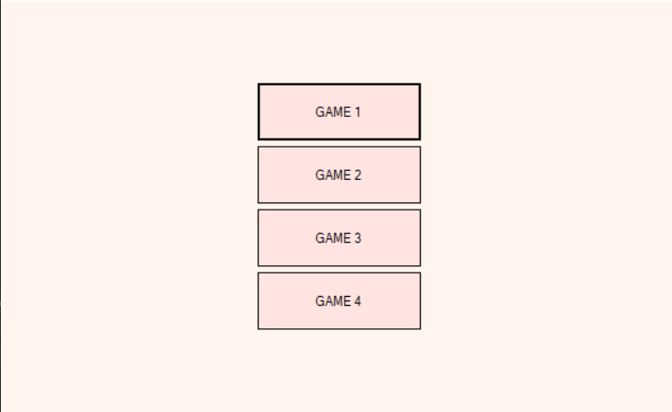
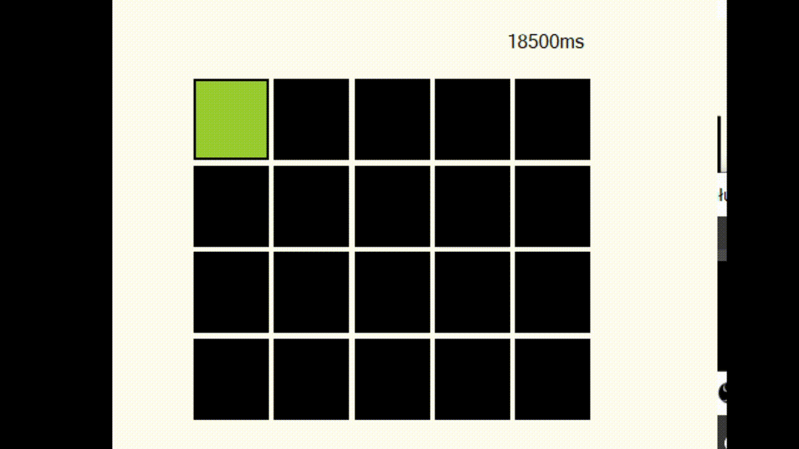
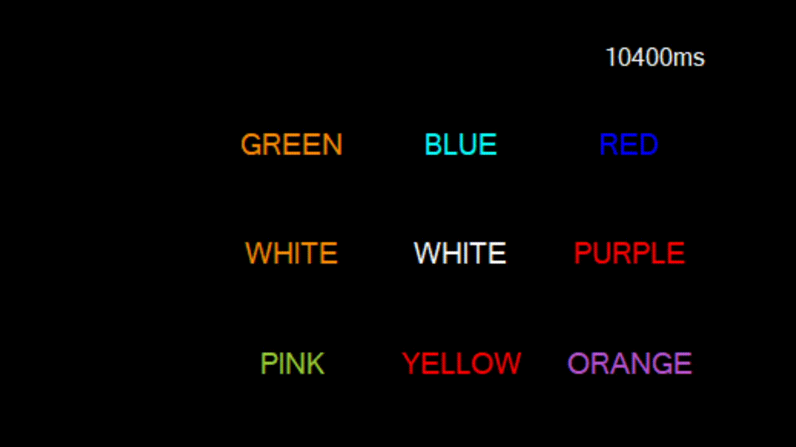
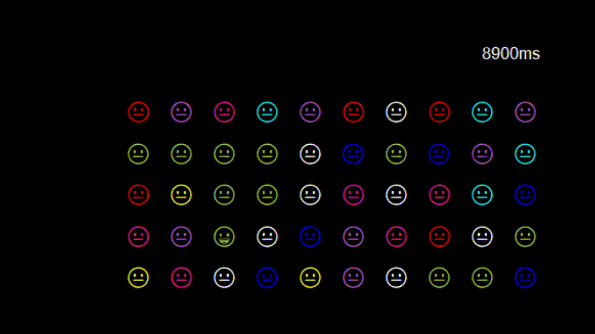

# Psychomotor mini games

## Table of contents
* [Description](#description)
* [Technologies](#technologies)

## Description
The application contains 4 mini-games aimed at improving psychomotor skills (among others, to improve eye-hand coordination and response to acoustic stimuli).

* Menu:

* Game 1:
The user's task is to press the green button in the shortest possible time.

* Game 2:
The user's task is to press the button on which the word matches the color of this word in the shortest possible time. 

* Game 3:
The application generates a sound and the user's task is to find and press the face that corresponds to that sound in the shortest possible time.
(for example: the sound "yay" → happy face)

* Game 4:
The user's task is to move the boy using the keyboard (with the 'a' and 'd' keys) and catch the healthy food for which he gets points. 
The user has 3 lives. After catching junk food, the user loses a life. The game ends when the user has lost all lives.

## Technologies
Project is created with Windows Forms C#.
